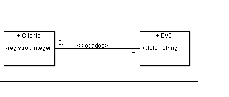
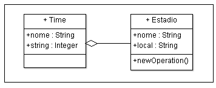
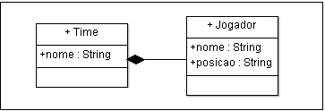
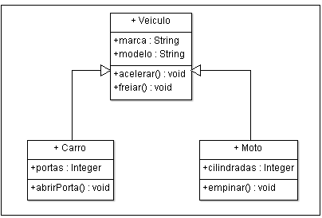
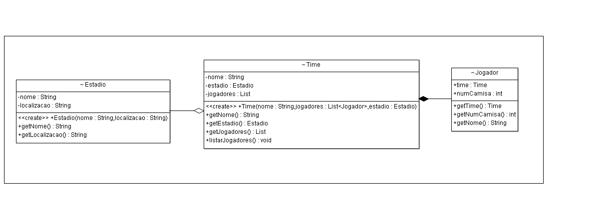

### Kauã Souza Maia - 536732

## [LISTA DE EXERCÍCIOS – Associações e Herança (link para Repositório)](https://github.com/Hactchubas/POO_git/tree/master/Portifólio%20B) 


### 1. Quais são as associações presentes na UM? Quais são as suas propriedades e como essas associações são implementadas no código-fonte (Java, C++ ou C#)? <hr>
- Associação Simples - [Código](https://github.com/Hactchubas/POO_git/tree/master/Portifólio%20B/Q1/Code/Q1/src/simple_assoc)
  - É um dos relacionamentos mais básico entre dois objetos, em que representa que um está relacionado a outro.
  - Propriedades: 
    - Multiplicidade: Quantifica como uma classe está relacionada a outra em questões numéricas. 
    - Direcionalidade (se a associação é unidirecional ou bidirecional)  


| Multiplicidade | Descrição |
|----------------|-----------|
| 0..1           | No máximo um. Indica que os objetos da classe associada não precisam obrigatoriamente estar relacionados.|
| 1..1           | Um e somente um. Indica que apenas um objeto da classe se relaciona com os objetos da outra classe.|
| 1..*           | Um ou muitos. Indica que há pelo menos um objeto envolvido no relacionamento.|
| 0..*           | Muitos. Indica que podem haver muitos objetos da classe envolvidos no relacionamento|
| 3..5           | Valores específicos. |

<br>
<br>
<br>

- Agregação - [Código](https://github.com/Hactchubas/POO_git/tree/master/Portifólio%20B/Q1/Code/Q1/src/agreg)
  - É uma forma especial de associação que demonstra que um objeto precisa ser complementado por um objeto de outra classe.
  - Relação "Todo-Parte":
    - objeto-todo: Parte maior, que é composta pelas partes.
    - objeto-parte: Parte menor, que compõe o objeto-todo
  - Representação: Uma linha contínua com um losango sem preenchimento na extremidade que contém os objetos-todo

    

- Composição - [Código](https://github.com/Hactchubas/POO_git/tree/master/Portif%C3%B3lio%20B/Q1/Code/Q1/src/agreg)
  - Uma variação do tipo agregação em que o vínculo entre objetos-todo e objetos-parte é mais forte
  - Objetos-parte têm que pertencer ao objeto-todo:
    - O todo não existe (ou não faz sentido) sem as partes
    - Ou, as partes não existem sem o todo
  - Representação: Uma linha contínua com um losango preenchido na extremidade que contém os objetos-todo
  
    


- Especialização / Generalização (Herança) - [Código](https://github.com/Hactchubas/POO_git/tree/master/Portif%C3%B3lio%20B/Q1/Code/Q1/src/agreg)
  - Identificar super-classe (geral) e subclasses (especializadas)
    - Semântica “é um”
    - Tudo que a classe geral pode fazer, as classes específicas também podem
  - Todos os atributos e métodos definidos na super-classe são
herdados pelas sub-classes 

     


- Dependência - [Código](https://github.com/Hactchubas/POO_git/tree/master/Portif%C3%B3lio%20B/Q1/Code/Q1/src/agreg)
  - Identifica uma ligação fraca entre objetos de duas classes
  - Representado por uma reta tracejada entre duas classes com uma seta na ponta que indica a dependência (no exemplo: DVD depende de Funcionario) 
  
     
  


### 2. Qual a diferença entre agregação e composição? Dê exemplos com código/UML. <hr>
[Códigos do exemplo](https://github.com/Hactchubas/POO_git/tree/master/Portifólio%20B/Q2/Code/Q2/src)
- Como explicado na questão 1, o que difere entre agragação e composição é a força das relações. Agragação, sendo mais fraca, uma classe complementa atributos de outra, mas elas não dependem entre si para existir. 
- Na composição no entanto não é assim, existe uma relação mais forte em que uma classe só existe na presença da outra e/ou uma só faz sentido existir se ela fizer parte (compor outra).
- No exemplo a seguir imagine o seguinte:
  - Um Time só existe se ele tiver jogadores para o compor, assim como os jogadores só são realmete jogadores se estiverem em um time.
  - Um estádio existe independenete do time, uma vez construído ele pode ser usado em muitos contextos, mas o estádio pode fazer parte do time, pode ser que aquele estádio "seja do time X", fazendo parte da identidade daquele time.
   

```java    
import java.util.List;
class Time {
    private String nome;
    private Estadio estadio; // Agregação: o estádio pode existir independentemente do time
    private List<Jogador> jogadores; // Composição: os jogadores existem dentro do contexto do time e o time depende deles para existir

    public Time(String nome,List<Jogador> jogadores,  Estadio estadio) {
        this.nome = nome;
        this.estadio = estadio;
        this.jogadores = jogadores;
    }

    public String getNome() {
        return nome;
    }

    public Estadio getEstadio() {
        return estadio;
    }

    public List<Jogador> getJogadores() {
        return jogadores;
    }

    public void listarJogadores() {
        System.out.println("Jogadores do " + this.nome + ":");
        for (Jogador jogador : jogadores) {
            System.out.println("- " + jogador.getNome() + " torce para" + jogador.getTime());
        }
    }
}
```
```java 
// Classe Estadio representando um estádio de futebol
class Estadio {
    private String nome;
    private String localizacao;

    public Estadio(String nome, String localizacao) {
        this.nome = nome;
        this.localizacao = localizacao;
    }

    public String getNome() {
        return nome;
    }

    public String getLocalizacao() {
        return localizacao;
    }
}
```
```java 
// Classe Jogador representando um jogador de futebol
class Jogador extends Pessoa {
    public Time time;
    public int numCamisa;

    public Jogador(Time time, int numCamisa){
        this.numCamisa = numCamisa;
        this.time = time;
    }

    public Time getTime() {
        return time;
    }
    public int getNumCamisa() {
        return numCamisa;
    }
    public String getNome() {
        return nome;
    }
}
```
```java 
public class Pessoa {

    public String nome;
    private Long id;
}
```


### 3. Explique o que é herança? Explique como funcionam os mecanismos de sobreposição (override) e de sobrecarga (overload) de métodos<hr>
  - #### a) Implemente um pequeno programa ilustrando esses três conceitos.
    - A sobrecarga (overloading) ocorre quando você mantém o mesmo nome do método, mas altera o número ou o tipo de parâmetros. A sobrescrita (overriding) acontece quando você mantém o mesmo nome e assinatura do método, mas altera a implementação. Além disso, é possível sobrecarregar métodos privados e estáticos, mas não é possível sobrescrevê-los.
    - 
```java    
class Employee {
    private String name;
    private double baseSalary;

    public Employee(String name, double baseSalary) {
        this.name = name;
        this.baseSalary = baseSalary;
    }

    // Método para calcular o salário
    public double calculateSalary() {
        return baseSalary;
    }

    public void assignTask(String task) {
        System.out.println(name + " está realizando a tarefa: " + task);
    }

    // Sobrecarga do método assignTask com complexidade
    public void assignTask(String task, int priority) {
        System.out.println(name + " está realizando a tarefa: " + task + " com prioridade " + priority);
    }

    public String getName() {
        return name;
    }

    public double getBaseSalary() {
        return baseSalary;
    }
}
```
```java    
class Manager extends Employee {
    private double bonus;

    public Manager(String name, double baseSalary, double bonus) {
        super(name, baseSalary);
        this.bonus = bonus;
    }

    // Sobrepondo o método calculateSalary
    @Override
    public double calculateSalary() {
        return super.calculateSalary() + bonus;
    }
    // Sobrepondo o método assignTask
    @Override
    public void assignTask(String task) {
        System.out.println(getName() + " (Manager) está delegando a tarefa: " + task);
    }
}
```
```java    
class Intern extends Employee {
    public Intern(String name, double baseSalary) {
        super(name, baseSalary);
    }

    // Sobrepondo o método calculateSalary
    @Override
    public double calculateSalary() {
        return super.calculateSalary() * 0.5; // Estagiário recebe metade do salário base
    }
    // Sobrepondo o método assignTask
    @Override
    public void assignTask(String task) {
        System.out.println(getName() + " (Intern) está realizando a tarefa: " + task);
    }
}
```
```java    
public class Main {
    public static void main(String[] args) {
        // Criando objetos
        Employee emp = new Employee("John", 3000);
        Manager mgr = new Manager("Alice", 5000, 2000);
        Intern intern = new Intern("Bob", 1500);

        // Exibindo salários
        System.out.println(emp.getName() + " Salário: " + emp.calculateSalary());
        System.out.println(mgr.getName() + " Salário: " + mgr.calculateSalary());
        System.out.println(intern.getName() + " Salário: " + intern.calculateSalary());

        // Atribuindo tarefas
        emp.assignTask("Revisar relatórios");
        mgr.assignTask("Preparar apresentação");
        intern.assignTask("Organizar arquivos");

        // Demonstrando sobrecarga
        emp.assignTask("Revisar relatórios", 1);
        mgr.assignTask("Preparar apresentação", 2);
    }
}
```

### 4. Desenvolva uma discussão sobre o recurso de herança múltipla, seus perigos e suas oportunidades.<hr>

### 5. Quais as vantagens e desvantagens de usar composição no lugar da herança? Essa é talvez a questão mais importante da disciplina!<hr>
