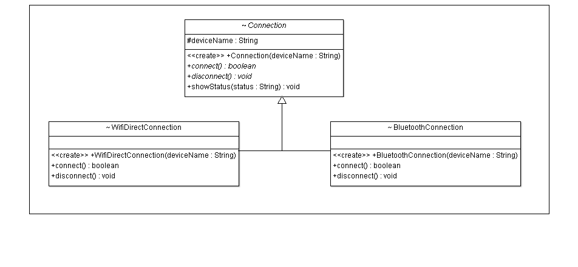

### Kauã Souza Maia - 536732

## [LISTA DE EXERCÍCIOS – Polimorfismo, Classes Abstratas e Interfaces (link para Repositório)](https://github.com/Hactchubas/POO_git/tree/master/Portifólio%20C) 


### 1. Desenvolva uma discussão sobre (a) “O que é o polimorfismo” e (b) “como esse pilar da POO pode ser implementado”. Sugestão: abordar os conceitos de ligação antecipada (early binding) e ligação tardia (late binding)  <hr>

- a) Polimorfismo é um dos pilares da programação orientada a objetos. Ela representa a mutabilidade do código orientado a objetos, fazendo com que seja mais flexível e dinâmico, colocando dentro das regras do código estruturado de sua natureza uma maneira de moldar para diferentes ocasiões. 
  <br><br>
  Como o próprio nome sugere, "poli" (muitos, multiplos) "morfismo" (forma), trata-se de elementos do código serem flexíveis quanto a forma, apesar de manterem sua natureza. Em termos simples, polimorfismo permite que um único método ou interface opere em diferentes tipos de dados ou objetos.<br><br>
  Duas são as formas principais do polimorfismo, Sobrecarga e Sobrescrita:
    - Sobrecarga: Ocorre quando métodos compatilham o mesmo nome, mas diferem em suas assinaturas, seja o número ou tipo dos parâmetros.
    - Sobrescrita: Ocorre quando uma subclasse substitui o comportamento de um método da superclasse. Isso permite que objetos de diferentes classes que compartilham um mesmo método (ou que implementam a mesma interface) possam ser tratados de maneira uniforme.
  
- b) O polimorfismo pode ser implementado em diferentes contexto e necessidades, mas para exemplo e aprofundamento explicativo podemos explorar os conceitos (como sugerido) de "Early Binding" e "Late Binding"
  - Early binding (ou Ligação antecipada): Ocorre em tempo de compilação. Neste caso, o compilador determina qual método deve ser chamado com base na assinatura dos métodos. A sobrecarga de métodos é um exemplo típico de ligação antecipada.
  <br>
  <br>
  Ex.: Imagine que estamos desenvolvendo um sistema que precisa autenticar usuários de diferentes maneiras: através de um nome de usuário e senha, através de um token de API, ou até mesmo via integração com um sistema OAuth.

```java
class AutenticacaoService {

    // Método para autenticação por nome de usuário e senha
    public boolean autenticar(String username, String password) {
        // Lógica para autenticar usando nome de usuário e senha
        if(username.equals("admin") && password.equals("1234")) {
            return true;
        }
        return false;
    }

    // Sobrecarga para autenticação por token de API
    public boolean autenticar(String apiToken) {
        // Lógica para autenticar usando um token de API
        if(apiToken.equals("valid_api_token")) {
            return true;
        }
        return false;
    }

    // Sobrecarga para autenticação via OAuth
    public boolean autenticar(OAuthToken oAuthToken) {
        // Lógica para autenticar usando OAuth
        if(oAuthToken.isValid()) {
            return true;
        }
        return false;
    }
}

class OAuthToken {
    // Simulação de um token OAuth
    public boolean isValid() {
        // Verifica se o token é válido
        return true;
    }
}

public class Main {
    public static void main(String[] args) {
        AutenticacaoService authService = new AutenticacaoService();

        // Autenticação por nome de usuário e senha
        boolean isAuthenticated = authService.autenticar("admin", "1234");
        System.out.println("Autenticado por nome de usuário/senha: " + isAuthenticated);

        // Autenticação por token de API
        isAuthenticated = authService.autenticar("valid_api_token");
        System.out.println("Autenticado por token de API: " + isAuthenticated);

        // Autenticação via OAuth
        OAuthToken oAuthToken = new OAuthToken();
        isAuthenticated = authService.autenticar(oAuthToken);
        System.out.println("Autenticado via OAuth: " + isAuthenticated);
    }
}
```

  -
    - Late Binding (Ligação tardia): Ocorre quando a decisão sobre qual método invocar é feita em tempo de execução. Isso é típico da sobrescrição de métodos em hierarquias de herança, onde o método que será chamado depende do tipo real do objeto.
  <br>
  <br>
  Ex.: Imagine que estamos desenvolvendo um sistema de notificação onde diferentes tipos de notificações precisam ser enviadas. Cada tipo de notificação (email, SMS, push notification) terá uma implementação específica de envio. Utilizamos a sobrescrita de métodos para permitir que cada tipo de notificação implemente seu próprio comportamento.

```java
// Classe base para notificações
abstract class Notificacao {
    // Método a ser sobrescrito nas subclasses
    public abstract void enviar(String mensagem);
}

// Classe concreta para notificações por email
class NotificacaoEmail extends Notificacao {
    @Override
    public void enviar(String mensagem) {
        // Lógica para enviar email
        System.out.println("Enviando email com a mensagem: " + mensagem);
    }
}

// Classe concreta para notificações por SMS
class NotificacaoSMS extends Notificacao {
    @Override
    public void enviar(String mensagem) {
        // Lógica para enviar SMS
        System.out.println("Enviando SMS com a mensagem: " + mensagem);
    }
}

// Classe concreta para notificações por push notification
class NotificacaoPush extends Notificacao {
    @Override
    public void enviar(String mensagem) {
        // Lógica para enviar push notification
        System.out.println("Enviando Push Notification com a mensagem: " + mensagem);
    }
}

public class Main {
    public static void main(String[] args) {
        // Criamos diferentes tipos de notificações
        Notificacao notificacaoEmail = new NotificacaoEmail();
        Notificacao notificacaoSMS = new NotificacaoSMS();
        Notificacao notificacaoPush = new NotificacaoPush();

        // Usamos ligação tardia para enviar a mensagem de acordo com o tipo da notificação em tempo de execução
        notificacaoEmail.enviar("Bem-vindo ao nosso serviço!");
        notificacaoSMS.enviar("Seu código de verificação é 1234.");
        notificacaoPush.enviar("Você tem uma nova mensagem.");
    }
}
```

### 2. Explique como funcionam as (tentativas de) conversões entre tipos polimórficos, isto é, upcasting e downcasting. Dê exemplos em código-fonte. Quando devemos usar um ou o outro ao criar um programa de computador?  <hr>

- Upcasting e Downcasting são formas de tratar e acessar objetos baseado em sua herança ou super/sub classes. Em geral, suas utilizações dependem da necessecidade de ser mais genérico ou específico.
  <br><br>
Exemplo: Upcasting e Downcasting em um Sistema de Gerenciamento de Usuários
  -   Explicação do Upcasting: No exemplo, RegularUser e Admin são subclasses de User. Através do upcasting, estamos tratando usuario1 e usuario2 como instâncias de User, permitindo que chamemos o método realizarAcao que é implementado de forma polimórfica em cada subclasse.
  -   Explicação do Downcasting: No método verificarERealizarAcao, estamos verificando se o usuario é uma instância de Admin usando instanceof. Se for, realizamos o downcasting para que possamos acessar propriedades ou métodos específicos da classe Admin. Se não for, tratamos como um RegularUser.

```java 
import java.util.*;

// Classe base para usuários
abstract class User {
    protected String nome;

    public User(String nome) {
        this.nome = nome;
    }

    public abstract void realizarAcao();

    public String getNome() {
        return this.nome;
    }
}

// Classe concreta para usuários regulares
class RegularUser extends User {
    public RegularUser(String nome) {
        super(nome);
    }

    @Override
    public void realizarAcao() {
        System.out.println(nome + " está realizando uma ação de usuário regular.");
    }
}

// Classe concreta para usuários administradores
class Admin extends User {
    public Admin(String nome) {
        super(nome);
    }

    @Override
    public void realizarAcao() {
        System.out.println(nome + " está realizando uma ação de administrador.");
    }
}

public class Q2 {
    public static void main(String[] args) throws Exception {
        /**
         * Upcasting
         **/
        System.out.println("Upcasting --------");
        User usuario1 = new RegularUser("Kauã"); // Upcasting implícito
        User usuario2 = new Admin("Gilvan"); // Upcasting implícito

        // Chama a ação específica do usuário
        usuario1.realizarAcao(); // Output: "Alice está realizando uma ação de usuário regular."
        usuario2.realizarAcao(); // Output: "Bob está realizando uma ação de administrador."

        // Perceba que o upcasting é implicito, pois temos sempre certeza que cada subclasse é uma especialização da superclasse
        // e assim pode ser tratada como uma instância dela.
        // Forma de generalizar esse objetos pondo em uma lista da classe genérica apesar de serem especializadas
        ArrayList<User> userList = new ArrayList<User>();
        userList.add(usuario1);
        userList.add(usuario2);

        for (User user : userList){
            System.out.println(user.getNome() +": "+user.getClass());
        }
        // Alice: class RegularUser
        // Bob: class Admin
        System.out.println("--------");
        System.out.println("Downcasting --------");
        /**
         * Downcasting
         */

        verificarERealizarAcao(usuario1); // Verifica e realiza ação
        verificarERealizarAcao(usuario2); // Verifica e realiza ação

        // Aqui outro exemplo do porque o downcast não é tão natural quanto o upcasting
        // Não temos como ter certeza se as instâcias de user são do tipo específica que se quer usar.
        ArrayList<Admin> userList2 = new ArrayList<>();
        for (User user : userList){
            adicionarALista(user, userList2);
        }
        System.out.println("--------");
    }

    public static  void adicionarALista(User user, ArrayList<Admin> list) throws Exception{
        try{
            Admin admin1 = (Admin) user;
            if(list.add(admin1)){
                System.out.println(admin1.getNome() +": "+admin1.getClass()+" adicionado à lista de Admin com sucesso");
            }
        } catch (Exception e){
            System.out.println("Falha ao adicionar "+ user.getNome() +" a lista de Admin: "+ e);
        }
    }

    // Downcating apresenta riscos a mais ao ser utilizado
    // e por isso é importante tratar e/ou pensar nisso quando usar no código.
    public static void verificarERealizarAcao(User usuario) {
        if (usuario instanceof Admin) { // Verificação antes do downcasting
            Admin admin = (Admin) usuario; // Downcasting explícito
            System.out.println(admin.nome + " tem acesso a ações administrativas.");
            admin.realizarAcao();
        } else {
            System.out.println(usuario.nome + " não é um administrador.");
            usuario.realizarAcao();
        }
    }
}
```

### 3. O que é uma classe abstrata? Para quê serve? Mostre um exemplo em UML e em código-fonte.  <hr>

- Classe abstrata é uma forma de criar uma entidade da POO como se fosse uma classe comum, mas com alguns detalhes. Uma classe abstrata não pode ser instanciada, sua função está em ser de base para outras classes que vem a seguir, pois suas subclasses vão poder desfrutar da estrutura dela pré estabelecida. No entanto, outra caracteristia chave de uma clasee abstrata é que além dos métodos comuns (concretos) que ela possui e as suas classes filhas herdam, ela tem também métodos abstrados, métodos esses que tem estrutura, mas não implementação, obrigando que suas subclasses se responsaiblizem por isso.
Ou seja ela serve pois:
  -  Fornece uma Base Comum: Uma classe abstrata serve como uma base comum para um grupo de classes relacionadas, garantindo que todas as subclasses compartilhem uma estrutura e um comportamento comuns.
  -  Define Contratos: Ao incluir métodos abstratos, uma classe abstrata pode definir um "contrato" que as subclasses devem seguir. Isso força as subclasses a fornecer implementações específicas para esses métodos.
  -  Facilita a Manutenção: Como as subclasses compartilham código comum definido na classe abstrata, isso facilita a manutenção e a reutilização do código.
-  Exemplo: Vamos considerar um exemplo em que estamos implementando um sistema para gerenciar conexões entre dispositivos Android usando diferentes protocolos, como Bluetooth e Wi-Fi Direct. Nesse contexto, podemos usar uma classe abstrata para definir um contrato comum para qualquer tipo de conexão, enquanto as subclasses implementam a lógica específica para cada tipo de conexão.



```java 
// Classe abstrata Connection
abstract class Connection {
    protected String deviceName;

    public Connection(String deviceName) {
        this.deviceName = deviceName;
    }

    // Método abstrato para conectar ao dispositivo
    public abstract boolean connect();

    // Método abstrato para desconectar do dispositivo
    public abstract void disconnect();

    // Método concreto para exibir o status da conexão
    public void showStatus(String status) {
        System.out.println("Status da conexão com " + deviceName + ": " + status);
    }
}

// Subclasse para conexão via Bluetooth
class BluetoothConnection extends Connection {
    public BluetoothConnection(String deviceName) {
        super(deviceName);
    }

    @Override
    public boolean connect() {
        // Lógica fictícia para conectar via Bluetooth
        System.out.println("Tentando conectar ao dispositivo " + deviceName + " via Bluetooth...");
        boolean success = true; // Supondo que a conexão foi bem-sucedida
        showStatus(success ? "Conectado via Bluetooth" : "Falha na conexão Bluetooth");
        return success;
    }

    @Override
    public void disconnect() {
        // Lógica fictícia para desconectar via Bluetooth
        System.out.println("Desconectando de " + deviceName + " via Bluetooth...");
        showStatus("Desconectado via Bluetooth");
    }
}

// Subclasse para conexão via Wi-Fi Direct
class WifiDirectConnection extends Connection {
    public WifiDirectConnection(String deviceName) {
        super(deviceName);
    }

    @Override
    public boolean connect() {
        // Lógica fictícia para conectar via Wi-Fi Direct
        System.out.println("Tentando conectar ao dispositivo " + deviceName + " via Wi-Fi Direct...");
        boolean success = true; // Supondo que a conexão foi bem-sucedida
        showStatus(success ? "Conectado via Wi-Fi Direct" : "Falha na conexão Wi-Fi Direct");
        return success;
    }

    @Override
    public void disconnect() {
        // Lógica fictícia para desconectar via Wi-Fi Direct
        System.out.println("Desconectando de " + deviceName + " via Wi-Fi Direct...");
        showStatus("Desconectado via Wi-Fi Direct");
    }
}

// Exemplo de uso no main
public class Main {
    public static void main(String[] args) {
        Connection bluetoothConnection = new BluetoothConnection("Speaker");
        Connection wifiDirectConnection = new WifiDirectConnection("Smart TV");

        bluetoothConnection.connect();
        wifiDirectConnection.connect();

        bluetoothConnection.disconnect();
        wifiDirectConnection.disconnect();
    }
}
```

### 4. Qual a função das interfaces em POO? Liste e explique as diferenças entre interfaces e classes abstratas.Também discuta sobre como as diferentes linguagem podem entregar essa característica da POO de formas diferentes. <hr> 

- Uma interface é como um contrato que define um conjunto de método que as classes que quiserem "realizar"/"implementar" aquela interface devem também implementar obrigatoriamente seus métodos. Definindo um comportamento comum entre várias classes independente de hierarquia de herança.
- As principais funções de uma interface:
  - Definir o contrato: a interface define para as classes implementadoras o que deve ser seguido, especificando quais métodos deve ser fornecidos.
  - Implementação multipla: Diferente das classes abstratas, uma classe pode implementar multiplas interfaces, permitindo multiplos comportamentos.
  - Reusabilidade e flexibilidade: Permitem que o mesmo código funcione com diferentes implementações de uma interface, facilitando a troca e o reuso de implementações. 

- Algumas diferenças entre Classes Abstratas e Interfaces:

| Aspecto | Interface | Classe Abstrata |
|-------|------|------|
|Métodos|Métodos são implicitamente públicos e abstratos (exceto métodos estáticos e default em algumas linguagens)|Pode ter métodos abstratos (sem implementação) e concretos (com implementação)|
|Herança| Uma classe pode implementar várias interfaces | Uma classe pode estender apenas uma classe abstrata (herança simples) |
|Atributos| Não pode ter atributos de instância, apenas constantes (em algumas linguagens, como Java) | Pode ter atributos de instância e métodos concretos |
|Construtores| Não pode ter construtores | Pode ter construtores |
|Modificadores de Acesso| Todos os métodos são públicos por padrão | Métodos podem ter diferentes modificadores de acesso (público, protegido) |
|Objetos| Não pode ser instanciada diretamente | Pode ser instanciada se tiver métodos concretos |
|Uso| Ideal para definir comportamentos que podem ser compartilhados por classes não relacionadas | Ideal para definir uma hierarquia de classes com comportamento comum |


- Java
  - Interface: Em Java, interfaces são tipos que podem conter apenas assinaturas de métodos (e, a partir do Java 8, métodos default e estáticos) e constantes (campos públicos, estáticos e finais). Classes ou outras interfaces podem implementar interfaces usando a palavra-chave implements.
  - Uso: Interfaces em Java são usadas para definir contratos que as classes devem seguir, permitindo que diferentes classes possam ser tratadas de forma polimórfica.
``` java
interface Payment {
    void pay(double amount);
}

class CreditCardPayment implements Payment {
    @Override
    public void pay(double amount) {
        // Implementação do pagamento via cartão de crédito
    }
}

```

  - C#
      - Interface: C# tem um sistema de interfaces muito semelhante ao de Java. Interfaces em C# também definem contratos que as classes podem implementar.
      - Uso: As interfaces em C# também suportam métodos padrão (default) desde a versão C# 8.0, permitindo uma implementação padrão que pode ser compartilhada entre todas as classes que a implementam.
``` csharp
interface IPayment {
    void Pay(double amount);
}

class CreditCardPayment : IPayment {
    public void Pay(double amount) {
        // Implementação do pagamento via cartão de crédito
    }
}

```
  - Python
    - Interface: Python não tem uma estrutura formal para interfaces como Java ou C#. No entanto, o conceito de interfaces pode ser simulado usando classes abstratas (ABC - Abstract Base Class) e módulos como abc.
    - Uso: Python usa a "duck typing" para verificar se um objeto implementa os métodos necessários. Se uma classe possui os métodos exigidos, ela pode ser tratada como uma implementação dessa "interface"
``` python

from abc import ABC, abstractmethod

class Payment(ABC):
    @abstractmethod
    def pay(self, amount):
        pass

class CreditCardPayment(Payment):
    def pay(self, amount):
        # Implementação do pagamento via cartão de crédito
        pass

```

  - JavaScript (ES6+)
    - Interface: JavaScript, como uma linguagem orientada a protótipos, não tem interfaces formais. Porém, o conceito de interfaces pode ser implementado indiretamente através de classes e verificações manuais.
    - Uso: Interfaces em JavaScript podem ser simuladas criando classes ou usando funções e garantindo que objetos tenham os métodos necessários para cumprir o contrato desejado.
  
``` javascript
class Payment {
    pay(amount) {
        throw new Error("Method 'pay()' must be implemented.");
    }
}

class CreditCardPayment extends Payment {
    pay(amount) {
        // Implementação do pagamento via cartão de crédito
    }
}
```
  - Go
    - Interface: Go tem um sistema de interfaces muito distinto. Interfaces em Go são satisfatórias de forma implícita. Se um tipo implementa os métodos de uma interface, ele automaticamente implementa essa interface, sem a necessidade de declaração explícita.
    - Uso: Isso permite uma maior flexibilidade e um forte suporte ao polimorfismo.
``` golang
type Payment interface {
    Pay(amount float64)
}

type CreditCardPayment struct {}

func (cc CreditCardPayment) Pay(amount float64) {
    // Implementação do pagamento via cartão de crédito
}
```

  - Rust
    - Interface: Em Rust, interfaces são chamadas de "traits". Traits definem métodos que podem ser implementados por tipos (structs, enums). Ao contrário de interfaces em Java e C#, as traits em Rust podem ter métodos com implementação.
    - Uso: Traits permitem que você defina comportamento compartilhado em múltiplos tipos.

```rust
Copiar código
trait Payment {
    fn pay(&self, amount: f64);
}

struct CreditCardPayment;

impl Payment for CreditCardPayment {
    fn pay(&self, amount: f64) {
        // Implementação do pagamento via cartão de crédito
    }
}
```

- Conclusão:
A implementação de interfaces e a entrega desse conceito de POO variam amplamente entre linguagens, dependendo de suas filosofias de design e objetivos. Em linguagens como Java e C#, o conceito é formal e estruturado, enquanto em linguagens como Python e JavaScript, o conceito é mais implícito e flexível. Em Go e Rust, as interfaces ou traits são potentes e permitem alto grau de polimorfismo e reuso de código.


### 5. Desenvolva um programa simples (ou não, isso fica a seu critério!) que utilize os conceitos de interface e classe abstrata como formas de favorecer (ou forçar) o polimorfismo<hr> 

  - [Código em kotlin](/Portifólio%20C/Code_Kotlin/src/main/kotlin/Q5/)